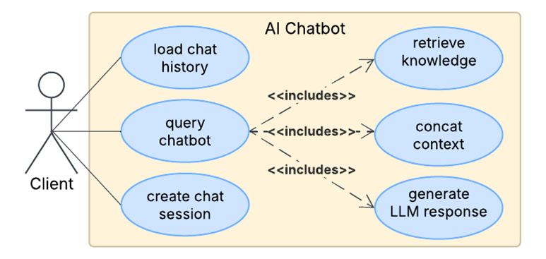

# 🤖 AI Chatbot (Lexa) with Knowledge Base

An intelligent chatbot system integrated into a recipe manager that delivers fast, knowledge-grounded responses using the Gemini API.

## 💡 Motivation & Solution

Integrating intelligent chatbot functionality into desktop applications can be tedious. Developers often face issues like complex integration, slow response times, and unreliable output quality.
**Lexa** addresses these challenges by providing a **modular and embeddable chatbot framework**, featuring:

- 🔍 **Structured knowledge encoding** using Java Reflection
- ⚡ **Fast, grounded responses** via Gemini API
- 🧠 **Hallucination control** through structured few-shot prompting
- 🖼️ **Built-in JavaFX UI**, with support for chat history and ranked responses

The system is **domain-agnostic** and can be seamlessly adapted to other application contexts—not limited to recipe management. By using the Gemini API, Lexa sidesteps the need for resource-intensive AI training, offering a **cost-effective** and **reliable** solution out of the box.

## 🛠️ Tech Stack

- **Language:** Java  
- **UI Framework:** JavaFX (SceneBuilder)  
- **LLM API:** Gemini API  
- **Other:** Recipe Rank Queue, Chat History List, HashMap-based Knowledge Base

## 🚀 Features

- 🔧 **Modular Architecture**: Encodes recipe object properties into a structured knowledge base using Java Reflection.
- 💬 **Few-shot Prompting Pipeline**: Combines user input, encoded knowledge, and instructions to generate accurate responses (~1s).
- 🕓 **Chat History Management**: Stores and displays previous interactions for better context in ongoing conversations.
- 🍽️ **Top-3 Menu Ranking**: Includes queue-based favorite ranking logic for recipes, shown via a button in the chatbot UI.

## 🧩 System Architecture

### UML Diagrams

- **Use Case Diagram:**
  Shows how users interact with the chatbot system.

  

- **Class Diagram:**
  Illustrates the object structure, including chatbot logic, API client, UI components, and data structures.

  

  This class diagram shows the brief architecture of the AI chatbot system. Data fields and operations are omitted to highlight the core relationships among classes. The main functionality modules include:

  1. JavaFX UI Controller: handles the user interface components and user interactions. 

  2. Knowledge Base: stores relevant context information to be used in generating responses.
  3. LLMApiClient: formats the prompt and communicates with the LLM API to fetch answers.
  4. ChatHistory: maintains the conversation history between the user and the system.
  5. CustomADT: defines specialized data structures used across the system.

## 🧪 How to Run

1. **Clone the repo**:

   ```bash
   git clone https://github.com/Yuying-Jin/Chatbot-Lexa.git
   cd Chatbot-Lexa
   ```

2. **Open in your Java IDE (e.g., Eclipse)**.

3. **Install dependencies**:

   - If you're using **Eclipse**, import the project as a Java project and add the required JARs under a `libraries/` folder to Build Path.

4. **Configure API Key**:

   Create a `.env` file under the project root and insert your Gemini API key like so:

   ```erlang
   GEMINI_API_KEY=<your_gemini_api_key>
   ```

   > ⚠️ **Important:** Do **not** share this file publicly or commit it to version control.

5. **Run the app**:

   - Launch `Main.java` in `/application`
   - The UI should open and be ready to use.

## 📸 Demo


> Click on the purple `ChatBot Query` button to navigate to the chatbot page.


> Lexa responding with grounded, knowledge-based answers.

## 🤝 Credits

This project was developed collaboratively as a modular AI Chatbot system focused on intelligent, knowledge-grounded interaction:

- **Jiaye** – UI design and controller implementation, and favorite recipe ranking logic using queue and merge sorting (for displaying top 3 recipes).
- **Qiuyue** – Data management layer, including custom List/Array List structures and chat session/history functionality.
- **Yuying** – System architecture design, knowledge base construction (via reflection and hashing), and LLM API integration.